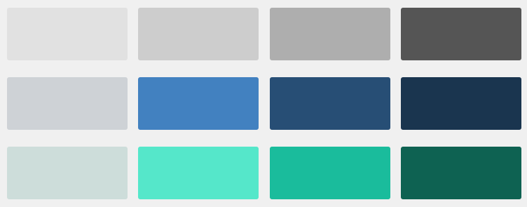

# Mardizza : Guide de style

Serge, le 16 février 2017

        <h2></h2>

Un point que je trouve important dans l’ambiance générale d’une 
start-up, ce sont les petites traditions qui se mettent en place et qui 
contribuent à la culture de l’entreprise.
Chez Wizaplace, l’une de ces traditions, c’est “Mardizza”, contraction, 
vous l’aurez deviné, de “mardi” et de “pizza”.

<h3 id="origine-de-lidée">Origine de l’idée</h3>

Comme souvent dans les cas de culture spontanée, la tradition est née
 avec deux ou trois personnes, qui, à force d’abnégation et de 
persévérance ont su instiller leur passion pour la pizza du mardi au 
reste de l’équipe.
Il faut dire que la proximité de <a href="http://www.montdorpizza.fr/">la meilleure pizzeria de Lyon</a>, et sa fermeture le lundi, leur a facilité la tâche.

Une fois la tradition établie, et plutôt fiers de notre capacité 
d’organisation, nous avons décidé de passer une commande groupée tous 
les mardis, évitant ainsi à chacun de devoir soi-même appeler la 
pizzeria, malin hein ?!

Le processus était le suivant, chacun se rend sur le site de la 
pizzeria, fait une capture d’écran de l’image de la pizza de son choix 
pour finalement la coller dans le canal dédié de Slack.
Le dernier à réaliser l’opération se voyait décerner le titre de préposé
 à la commande téléphonique.

Vous ai-je dit que nous étions fiers de notre organisation ?…

Tout comme nombre de ses confrères et étant soucieuse de fidéliser sa
 clientèle, ladite pizzeria propose une remise sur la 11ème pizza 
achetée.
C’est donc dans la joie que, toutes les 11 pizzas, l’un des membres de 
l’équipe Wizaplace se voit assurer un repas gratuit le mardi midi.

Cette personne peut ensuite, le coeur léger et l’estomac rempli, 
cocher son nom sur la feuille papier épinglée à cet effet, afin 
d’assurer un roulement équitable.

<h3 id="le-problème">Le problème</h3>

Maintenant que la situation est posée, je suis sûr que les plus 
pointilleux d’entre-vous auront remarqué le terme “feuille papier”, et 
de manière générale le caractère analogique de ce processus.

Nous ne sommes pas là pour critiquer une technologie qui a permis 
l’essor de nos civilisations modernes, mais pour le coup… “feuille 
papier” quoi…
Si comme moi vous luttez de toutes vos forces pour ne pas vous rouler en
 boule, les bras autour des genoux tout en répétant ces mots qui 
reviennent en boucle, hurlant dans votre tête : “automatisation, 
scalabilité, sélection automatique, pizza Margherita”, rassurez-vous mon
 histoire finit bien.

<h3 id="la-solution--mardizza-">La solution : Mardizza !!!</h3>

L’idée de réaliser une application web s’est très vite imposée à nous, bande
de développeur web, et c’est ainsi qu’est née <a href="#">mardizza.com</a>.

Partie d’une blague, il faut quand même bien l’avouer, l’application a
 grossi de manière organique, se voyant ajouter des fonctionnalités de 
plus en plus complexes sans avoir jamais été architecturée.

Les fonctionnalités phares étant le panier multi-utilisateurs, la 
possibilité d’appartenir à plusieurs groupes, le calcul automatique des 
remises et leur incidence sur la commande, le tout en utilisant des 
technos modernes comme <a href="https://vuejs.org/">Vuejs</a> ou encore <a href="https://firebase.google.com/">Firebase</a>.
Plutôt cool, hein ?

Malheureusement, le résultat de cette expansion non contrôlée se ressent au niveau du design, de l’UX et des algorithmes…

La situation est donc la suivante : nous avons une sorte de <abbr title="Minimum Viable Product">MVP</abbr>
 en place, qui ne demande qu’une joyeuse mise à jour.
Et c’est dans cette optique que j’inaugure aujourd’hui cette série 
d’articles sur la refactorisation de l’application : Mardizza 2.

Mardizza étant avant tout un projet pour rire, nous nous devons d’y 
apporter le plus grand sérieux et la plus grande rigueur.
Et comme une application web digne de ce nom se doit d’avoir un guide de style, je m’y suis collé et suis heureux de vous présenter le <a href="https://mardizza-ui-kit.netlify.com/">nouvel aspect visuel de Mardizza</a>.

En plus chez Wizaplace on est des gens biens, le code de l’ensemble 
des éléments de l’application est/sera disponible sur GitHub en open 
source, à commencer par <a href="https://github.com/sergemazille/mardizza_ui_kit">le guide de style</a>.

